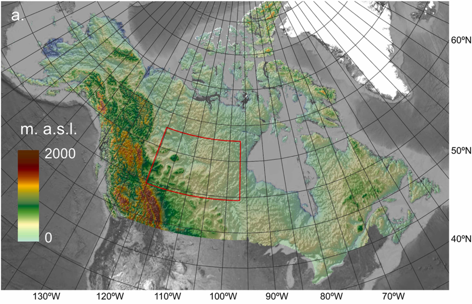

# CanAK IMERG
***
The CanAK_IMERG repository contains scripts that were used to produce bias-corrected satellite precipitation data for Canada and Alaska. Satellite precipitation data from the Integrated Multi-satellitE Retrievals for GPM (IMERG) were corrected for elevation using the Global Historical Climatology Network (GHCN) daily dataset and Multi-Error Removed Improved-Terrain digital elevation model (MERIT DEM). The correction was done at a daily and monthly scale. The monthly data produced are published on [ORNL DAAC](https://daac.ornl.gov/cgi-bin/dsviewer.pl?ds_id=2097/) and daily data are available upon request. The data are accompanied by a peer-reviewed paper published in [*Journal of Hydrology: Regional Studies*](https://www.sciencedirect.com/science/article/pii/S2214581823000733). 

A smaller study area centered on the Peace-Athabasca Delta (PAD) was first used to develop and test the methodology described, shown below outlined in red ([Lober et al.](https://www.sciencedirect.com/science/article/pii/S2214581823000733), Figure 1a). The scripts published use this smaller study area subset; the same methodology and functions were used on the larger area, with the exception that parallelization was added in order to speed up processing. 

 
